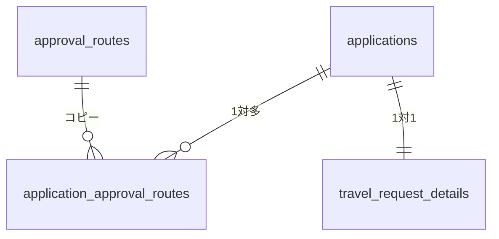

# Application DB & Program Restructure

このドキュメントでは、申請機能のテーブル構造とプログラム構造を整理し直す方針をまとめます。

## 本書の目的

テーブル再編成時に実施するマイグレーション手順やサービス層の役割分担を把握することを目的としています。既存データとの互換性を保ちつつ、安全に移行できるよう詳細を記載しています。

## 1. テーブル設計の方針

- **applications**: 申請者ID、申請種別ID、申請日など共通項目のみを保持する基底テーブル。
  - 主に `id`, `application_type_id`, `applicant_id`, `title`, `content`,
    `status`, `current_step` と監査用カラムのみを定義します。
  - 金額や期間といった申請種別固有の項目はここには含めません。
- **各種申請テーブル**: 出張申請など申請種別ごとに存在し、`application_id` を外部キーとして applications を参照する。各テーブルはサロゲートキー `id` を持ち、`application_id` は単なる参照カラムとする。
- **approval_routes**: 申請種別ごとの標準ルート定義を保持する既存テーブルを継続利用。
- **application_approval_routes**: 申請作成時点で抽出された承認ルートを保持するテーブル。主キーは `id` とし、`application_id` と `step_order` の組み合わせに一意制約を設定する。承認日時やコメント等もこのテーブルで管理する。



## 2. エンティティ構成

- `Application`: 基底情報を持つエンティティ。`@OneToOne` で各種申請エンティティと結合。
- `TravelRequestDetails` など各種申請エンティティ: サロゲートキー `id` を持ち、`application_id` で applications を参照して個別項目を保持。
- `ApplicationApprovalRoute`: 承認ルートの実体。`applicationId`、`stepOrder`、`approverId`、`status`、`action`、`comment`、`processedAt` などを持つ。

これらのエンティティはすべて `jp.co.apsa.giiku.domain.entity` 配下に配置します。

## 3. サービス層の役割

- `ApplicationService` のみが `Application` と `ApplicationApprovalRoute` を直接操作します。
- 各種申請サービス(例:`TravelRequestService`) は `ApplicationService` を利用してベース申請の作成・更新を行い、自身は詳細テーブルを扱います。

## 4. 処理フロー例

1. `TravelRequestService` が詳細入力を受け付ける。
2. `ApplicationService` を呼び出し、`Application` と `ApplicationApprovalRoute` を生成。
3. 生成された `application_id` を用いて `TravelRequestDetails` を保存。
4. 以降の承認処理は `ApplicationService` が `ApplicationApprovalRoute` を更新しながら進める。

## 5. 既存テーブルとの違い

- これまで `travel_requests` など個別テーブルは独立したIDを持っていましたが、今後は `applications` のIDを共有して一元管理します。
- `ApplicationApproval` エンティティは `ApplicationApprovalRoute` と名称・役割を明確化し、申請時点のルートを保持するテーブルへ置き換えます。

## 6. 今後の実装指針

- Flywayマイグレーションを追加し、上記テーブルを作成します。
- サービスとリポジトリを整理し、`ApplicationService` で申請と承認ルートを完結させる実装へ順次移行します。
- 既存の `TravelRequestService` などは `ApplicationService` を介して動作させるよう改修します。

## Javadocコメント規則

クラスのJavadocには次の項目を記載し、本文はすべて日本語で記述してください。

```
@author 株式会社アプサ
@version 1.0
@since 2025
```

## カラム配置の指針

申請関連テーブルでは業務カラムを定義した後に管理用カラム（created_by, created_at, updated_by, updated_at）をまとめて末尾へ配置します。詳細は [database_column_order.md](database_column_order.md) を参照してください。

